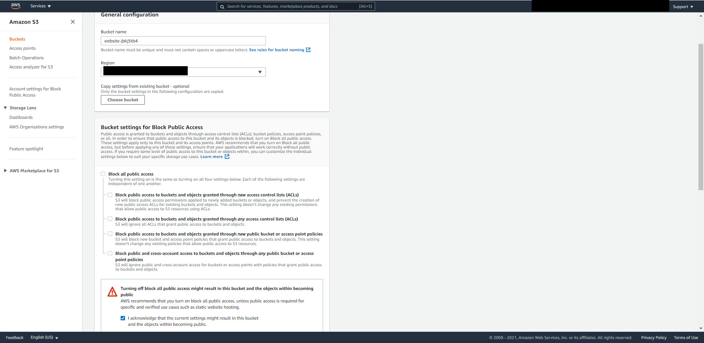
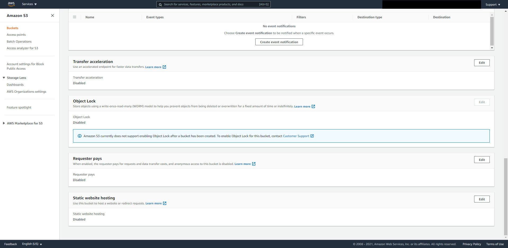
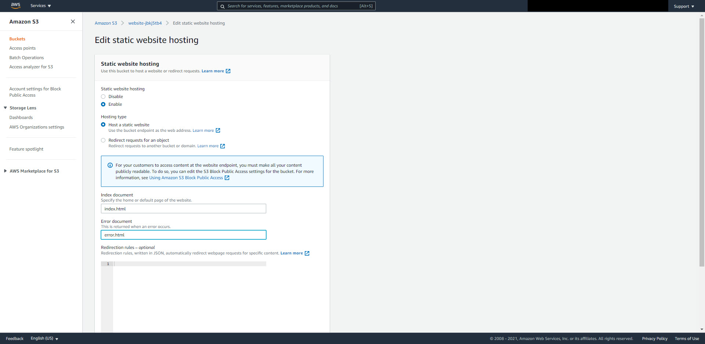
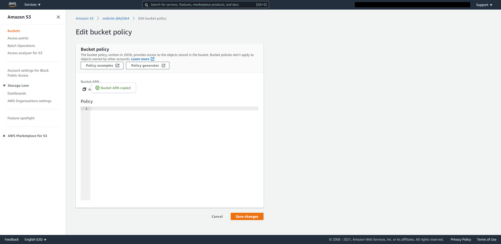
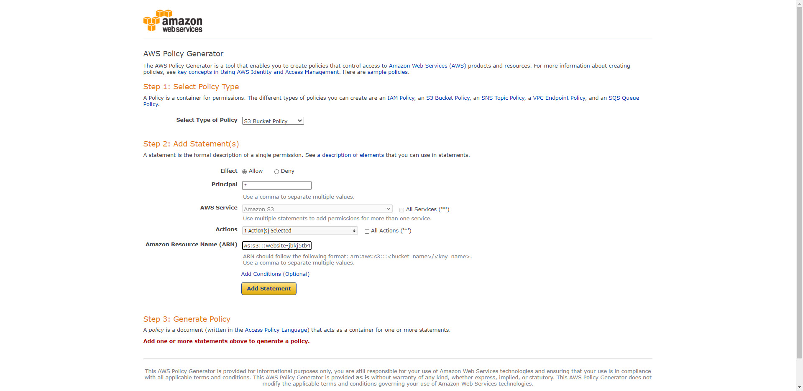
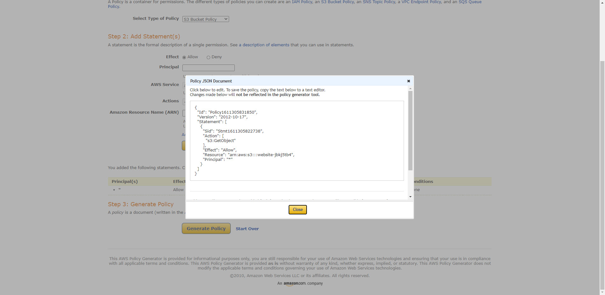
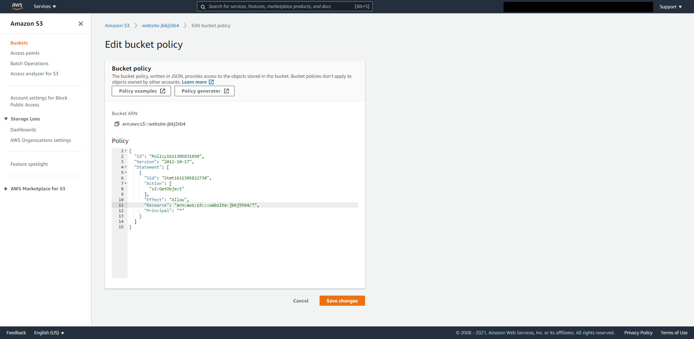
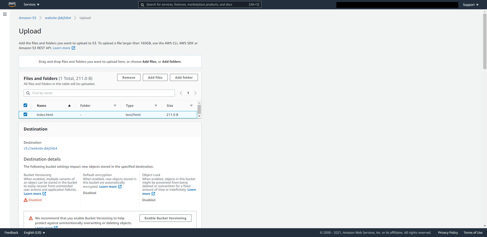
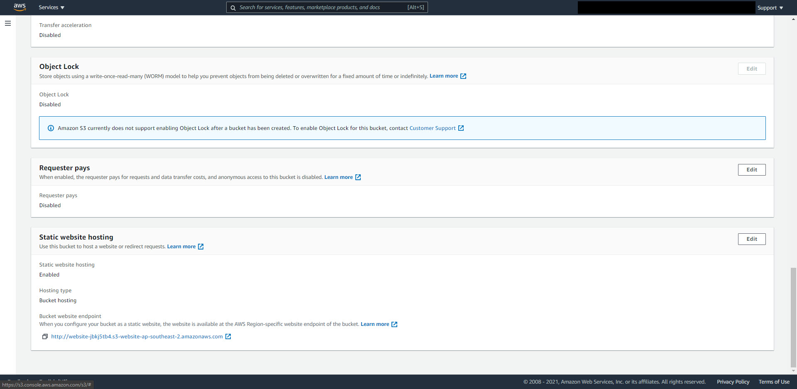
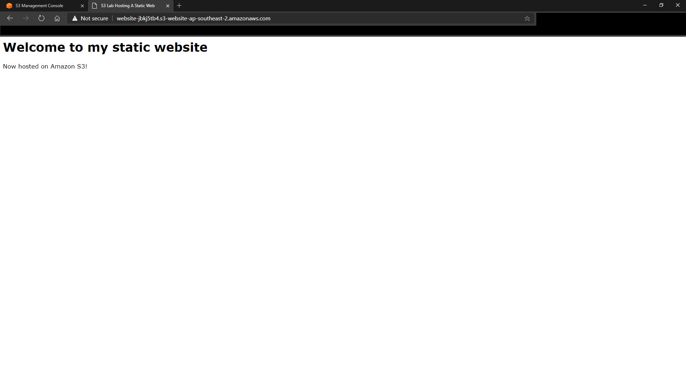

# S3 Hosting Static Website
---
1/ Vào S3 management Console tạo 1 bucket và uncheck Block Public Access. Sau đó bấm **Create Bucket**

2/ Chọn bucket đã tạo => Properties => kéo xuống => Static Web Hosting => Edit

3/ Edit static website và Save

4/ Chọn lại bucket => Permission => Bucket Policy => Edit => Copy Bucket ARN => Policy Generator

5/ Làm theo hình và chú ý:

* Action: drop-down menu => GetObjects
* Amazon Resource Name: Paste ARN vừa copy vào đây
* Sau cùng = > Add Statement

6/ Copy JSON code

7/ Về lại trang bucket policy khi nãy => paste JSON code vào phần Policy như hình:

* Phần Resource thêm **/*** vào cuối => Có tác dụng cho phép truy cập tất cả những file thuộc về bucket đã tạo policy => SAVE CHANGE

8/ Tạo 1 file **index.html** đơn giản và upload lên bucket. Hoặc vào folder files down về

9/ Trong phần upload file => Additional Options => Bucket Access Control List (Bucket ACL) => tick như hình => SAVE

10/ Chọn bucket => Properties => Kéo xuống Static Web Hosting => sẽ thấy End Point => Copy => Paste vào browser 

---
## Bài lab đã xong. Hãy nhớ xoá hết những gì vừa làm trên AWS để tránh việc trả chi phí không cần thiết.